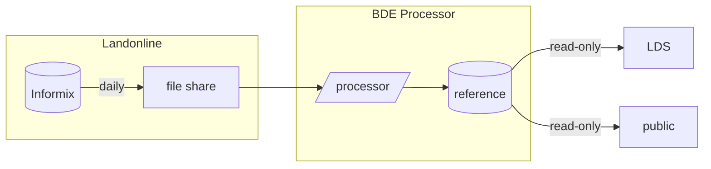

# Bulk Data Extract (BDE) Processor design

## User requirements

-  The _user interface_ is a read-only PostgreSQL database in AWS RDS, with
   Azure authentication.
-  _Accessible_ to all
   [current BDE users](https://github.com/linz/ds-infra-team/wiki/BDE-users).
-  Process BDE files
   _[every day](https://toitutewhenua.atlassian.net/wiki/spaces/GEOD/pages/86418416/BDE+Processor+Product)
   except Sunday_ into a structure conforming to the legacy BDE Processor DB.
   The processing should take _much_ less than a day.
-  Optional _post-processing_ pulled in from separate internal repository.
-  All changes for a single day are imported within a _single transaction._
-  _Immediate notification_ of completed import (like the legacy BDE Processor
   SNS topic).
-  Documentation (including SQL) of how the simplified layers are generated.
-  Schema changes synced with users.
-  End user documentation about how
-  _Table versioning._ TBD: Verify that the known use cases are still valid:
   -  Positioning uses it
      (["mostly parcels"](https://github.com/linz/bde-processor/pull/9#discussion_r1064884088))
      for further analysis in QGIS.
   -  The Koordinates import process requires it for a speed-up.

## Technical requirements

-  Keep BDE files. This could be done as a separate system, but that would
   complicate the architecture and release process. **TBD:** How long do we need
   to keep these files? Indefinitely is going to be very costly. A year would be
   cheaper, but completely arbitrary. Keeping just the last L0 and the
   associated L5 files would require some code, but would probably be the
   minimum we could keep to enable a restore from a blank slate. Also, which use
   cases do we have for this data?
-  Thorough testing of every part of the process before merging any pull
   requests.
-  Separate, managed accounts for infrastructure testing and production.
-  Trivial deployment.
-  Monitor performance characteristics.
-  Verbose logging to central ElasticSearch instance.
-  Alerts:
   -  Process start/finish with result and auxiliary information in case of
      failure.
   -  Big subprocesses' start/finish.
-  No/minimal Koordinates changes necessary, since these would be very costly.

## Wanted features

-  _Identical schema to current BDE._ This would ensure users would not need to
   change anything in their import process.
-  _Pull rather than push data from Landonline._ This way we can keep the entire
   system together, rather than having a costly and awkward split between
   on-premise and cloud architecture.
-  _Continuous deployment._ Any time a change is merged to the main branch some
   smoke tests are performed and the result is deployed to production.
-  _React to change rather than run on a timer,_ where possible. Ideally the BDE
   Processor should know about new files as soon as the last file has been
   closed for writing, and should immediately start processing.
-  _From-scratch deployment friendly._ That is, we should always have the option
   to deploy from scratch, deleting _all_ the resources we've created and
   getting back to an identical state (from the end users' perspective) in a
   timely fashion (that is, before the next data dump).
-  _Public access,_ which in turn requires:
   -  A separate user with read-only access to only the appropriately licensed
      tables (some have a restrictive customer license).
   -  Some way to
      [make sure users know about the Creative Commons licensing of the content](https://github.com/linz/bde-processor/pull/9#discussion_r1064211308)
      , maybe by having to get an API key to access it.
-  _Minimal code changes for upstream schema changes._ For example, rather than
   using complex schema migration code, we should be able to just change the ETL
   code and redeploy.
-  Read replica use _does not affect the performance of the pipeline to LDS._
   Basically just means we'll need to use separate read replicas for them.
-  Zero configuration. The service should rely on Azure SSO so we don't need to
   maintain users, we should not need to do any IP whitelisting, and the current
   version of the BDE Processor should only support the current version of
   Landonline.

## Data flow

## References

-  [Original BDE Processor](https://github.com/linz/bde-processor-deployment/)
   and dependent repositories
-  [bde-processor-deployment wiki](https://github.com/linz/bde-processor-deployment/wiki/)
-  [Internal documentation](https://toitutewhenua.atlassian.net/wiki/spaces/GEOD/pages/86419764/BDE+Processor)
